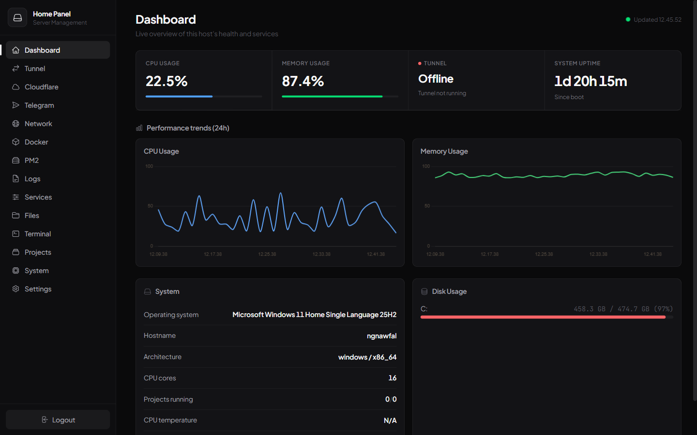
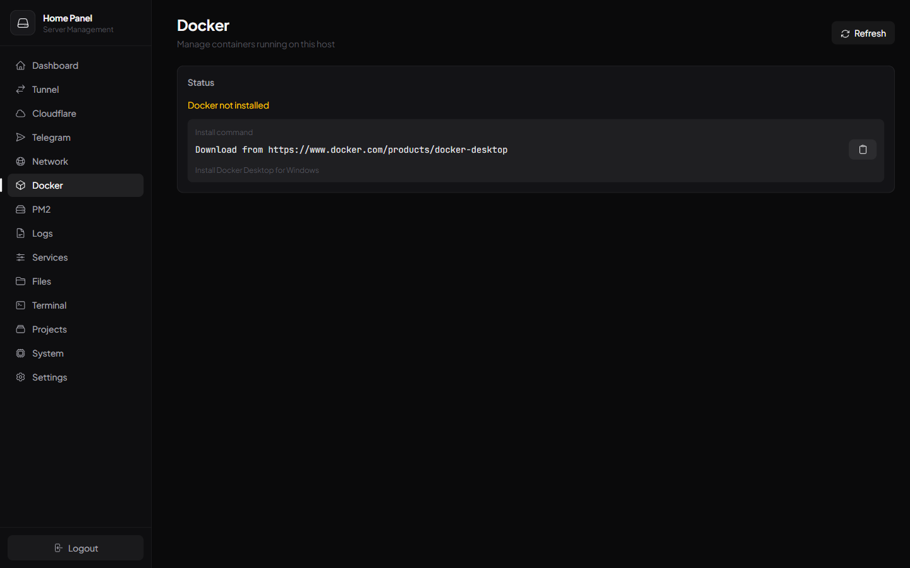
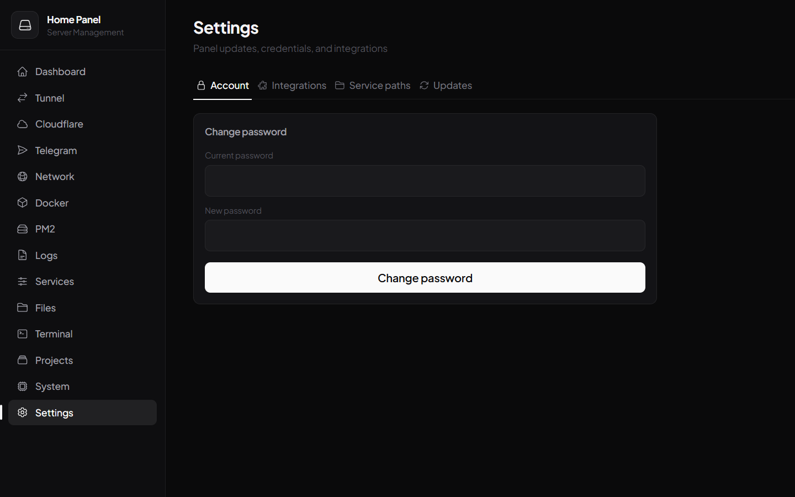

# 🏠 Nestcore

<div align="center">

**Homelab Management Dashboard**

[](LICENSE)
[](https://go.dev/)
[](CONTRIBUTING.md)

[📚 Documentation](docs/) • [🐛 Issues](https://github.com/nawfdev/home_panel/issues)

</div>

---

## ✨ What is Nestcore?

Nestcore is an all-in-one web dashboard for managing homelab infrastructure — Docker, PM2, systemd services, Cloudflare Tunnels, files, terminal, and system stats — from a single React frontend backed by a Go server. Runs on Windows or Linux.

---

## 📋 Requirements

- **Go 1.24+** and **Node.js** (build the backend/frontend)
- **ffmpeg** *(optional)* — on `PATH` so uploaded videos get remuxed to "faststart" in the background. Without it, phone-recorded videos (moov atom at the end of the file) can show as a stuck black player. Install: `apt install ffmpeg` (Linux) / `winget install ffmpeg` (Windows) / `brew install ffmpeg` (macOS).
- **aria2c** *(optional)* — on `PATH` so Movie downloads use aria2's resumable, multi-connection engine instead of the built-in single-connection downloader. The panel spawns/manages it automatically; no separate setup needed beyond having the binary available. Install: `apt install aria2` (Linux) / `winget install aria2.aria2` (Windows) / `brew install aria2` (macOS).
- **`SUBSOURCE_API_KEY`** *(optional env var)* — enables in-panel subtitle search on the Movies page (via [subsource.net](https://subsource.net)'s API). Get a free key from your subsource.net profile page.

---

## 🎯 Key Features

- **Monitoring** — real-time CPU/memory/disk/network stats, temperature, battery, historical graphs, configurable alert thresholds
- **Docker & PM2** — start/stop/restart, live logs, project export as ZIP
- **Services** — manage systemd units (Linux) or Windows services
- **Cloudflare** — tunnel status, ingress route editor, zone list, synced with the Cloudflare API
- **Telegram** — status/error notifications and test messages
- **Files** — browser-based file manager (view, edit, upload, download, delete)
- **Terminal** — WebSocket shell with ANSI color output
- **Projects** — manage arbitrary Node/script projects (start/stop/restart, ports, domains)
- **Settings** — password change, integration tokens, service path overrides, self-update check

### Security & Reliability
- Rate limiting (API & login)
- Path traversal / command injection protections
- bcrypt-hashed sessions and passwords
- Graceful shutdown (stops spawned tunnel/project processes cleanly on restart)

---

## 🚀 Quick Start

```bash
git clone https://github.com/nawfdev/home_panel.git
cd home_panel

# Backend config (copy examples, then fill in your own values)
cp config/config.example.json config/config.json
cp config/settings.example.json config/settings.json

# Build the frontend once (backend serves fe/dist by default)
cd fe && npm install && npm run build && cd ..

# Run the backend
npm start
# or: cd be && go run ./cmd/homepanel
```

**Access:** http://localhost:9689

First login uses whatever `defaultAdmin` you set in `config/config.json` — **set a real password there before first boot**, then change it again from the Settings page once logged in.

---

## 📸 Screenshots





---

## 📚 Documentation

- [📖 Full Documentation](docs/)
- [🐧 Linux Compatibility](docs/LINUX_COMPATIBILITY.md)
- [🔐 Security Guide](docs/SECURITY_CHANGES.md)
- [📱 Telegram Setup](docs/TELEGRAM_SETUP.md)
- [⚙️ PM2 Configuration](docs/PM2_SETUP.md)
- [🔄 Auto-Restart Setup](docs/TUNNEL_AUTO_RESTART.md)

---

## ⚙️ Configuration

Two files under `config/` hold live secrets and are **git-ignored** — copy the `.example.json` versions and fill them in yourself, never commit the real ones:

- `config/config.json` — server port/host, session secret, default admin credentials, alert thresholds
- `config/settings.json` — Cloudflare API token, Telegram bot token, service path overrides

`HOMEPANEL_ROOT` and `HOMEPANEL_FRONTEND_DIR` env vars can override the repo root and frontend directory if you're not running from a standard checkout layout.

---

## 📁 Project Structure

```
home_panel/
├── be/           # Go backend (cmd/homepanel, internal/*)
├── fe/           # React + Vite + Tailwind frontend
├── config/       # Runtime config (git-ignored) + .example.json templates
├── data/         # JSON data store (git-ignored)
└── docs/         # Setup guides
```

---

## 🛠️ Tech Stack

| Component | Technology |
|-----------|------------|
| **Backend** | Go + chi |
| **Frontend** | React + Vite + TypeScript + Tailwind CSS |
| **Icons** | Heroicons |
| **Database** | JSON file-based |
| **Charts** | Chart.js |
| **Container** | Docker CLI |
| **Process** | PM2 CLI |
| **Video processing** | ffmpeg (optional) |
| **System** | gopsutil |
| **Alerts** | Telegram Bot API |

---

## 🔒 Security Best Practices

### For Production:

1. **HTTPS** — use a reverse proxy (Nginx/Caddy) or a Cloudflare Tunnel
2. **Firewall** — restrict the panel port to trusted IPs
3. **Passwords** — set a strong `defaultAdmin` password before first boot, rotate it again after
4. **Secrets** — only `config/*.json` (not `*.example.json`) hold real tokens; never commit them
5. **Updates** — use the Settings → Updates tab or `git pull` + rebuild

**Example Nginx config:**

```nginx
server {
    listen 443 ssl;
    server_name panel.yourdomain.com;

    ssl_certificate /path/to/cert.pem;
    ssl_certificate_key /path/to/key.pem;

    location / {
        proxy_pass http://localhost:9689;
        proxy_http_version 1.1;
        proxy_set_header Upgrade $http_upgrade;
        proxy_set_header Connection 'upgrade';
    }
}
```

### Cloudflare API Integration

1. Go to the panel's **Settings → Integrations** tab.
2. Enter your Cloudflare API Token (permissions: `Zone:Read`, `Tunnel:Read`).
3. Click **Save & verify connection**.
4. The Cloudflare page will now show live tunnels and zones.

---

## 🐛 Troubleshooting

**Port 9689 already in use?** Change it in `config/config.json`.

**Terminal won't connect?** Check the WebSocket isn't blocked by a proxy, and that you're logged in.

**Permission denied on Linux (Docker)?** Add your user to the docker group: `sudo usermod -aG docker $USER`.

**Upload fails?** Check disk space and file size (default 500MB limit, configurable in Settings).

**Portrait/phone video stuck on a black screen in the player?** Install `ffmpeg` (see Requirements above) so new uploads get remuxed to faststart; re-upload any file that was uploaded before ffmpeg was installed.

---

## 🤝 Contributing

See [CONTRIBUTING.md](CONTRIBUTING.md) for guidelines.

---

## 📜 License

[MIT License](LICENSE)

---

## 🙏 Acknowledgments

Built with:
- [chi](https://github.com/go-chi/chi)
- [gopsutil](https://github.com/shirou/gopsutil)
- [React](https://react.dev/) + [Vite](https://vitejs.dev/)
- [Tailwind CSS](https://tailwindcss.com/)
- [Heroicons](https://heroicons.com/)
- [Chart.js](https://www.chartjs.org/)
